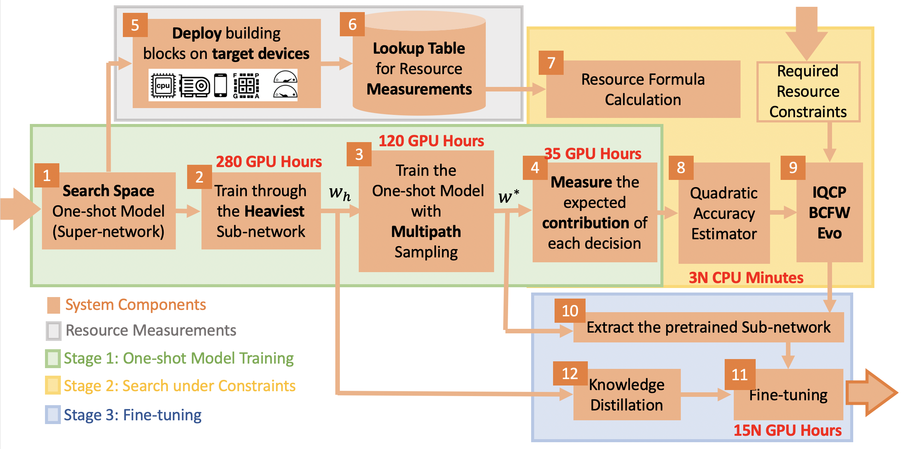
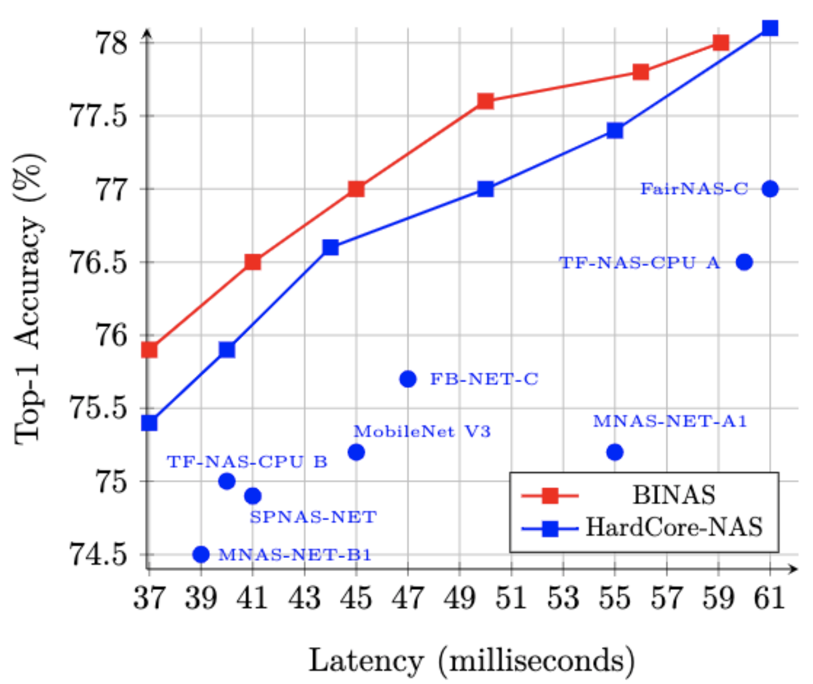
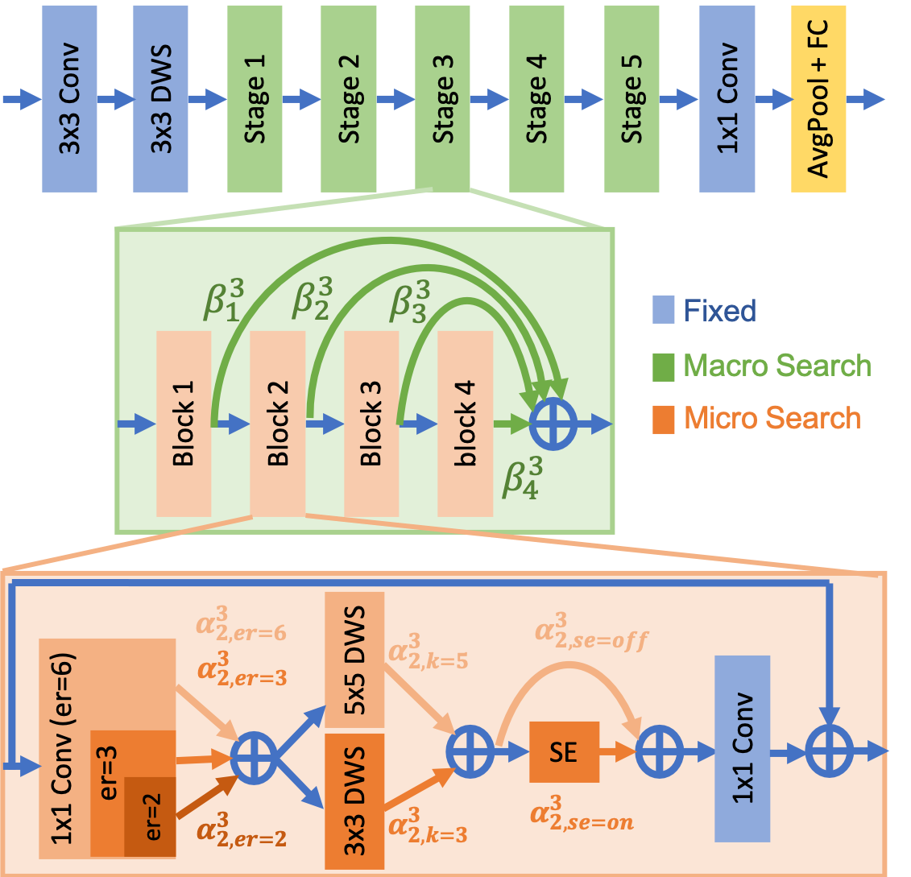
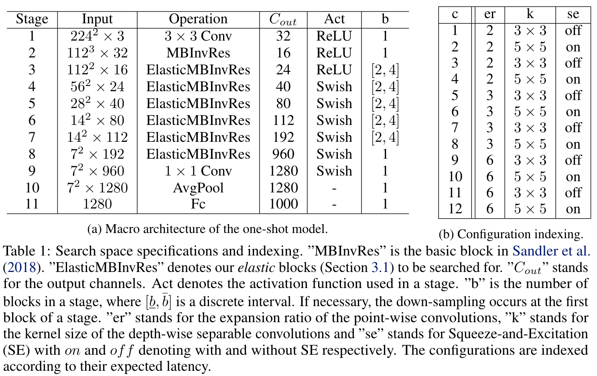
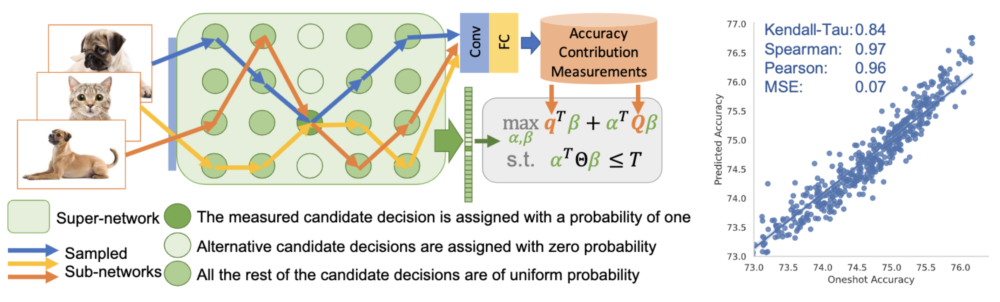

# BINAS: Bilinear Interpretable Neural Architecture Search

Code accompanying the paper:
> [BINAS: Bilinear Interpretable Neural Architecture Search](https://arxiv.org/abs/2110.12399)\
> Niv Nayman, Yonathan Aflalo, Asaf Noy,  Rong Jin, Lihi Zelnik-Manor.\
> _arXiv:2110.12399_.

Practical use of neural networks often involves requirements on latency, energy and memory among others.
A popular approach to find networks under such requirements is through constrained Neural Architecture Search (NAS). However, previous methods use complicated predictors for the accuracy of the network. 
Those predictors are hard to interpret and sensitive to many hyperparameters to be tuned, hence, the resulting accuracy of the generated models is often harmed.
In this work we resolve this by introducing Bilinear Interpretable Neural Architecture Search (BINAS), that is based on an accurate and simple bilinear formulation of both an accuracy estimator and the expected resource requirement, together with a scalable search method with theoretical guarantees. The simplicity of our proposed estimator together with the intuitive way it is constructed bring interpretability through many insights about the contribution of different design choices. For example, we find that in the examined search space, adding depth and width is more effective at deeper stages of the network and at the beginning of each resolution stage.
Our experiments show that BINAS generates 
comparable to or better architectures than other state-of-the-art NAS methods within a reduced marginal search cost, while strictly satisfying the resource constraints.

<p align="center">
    
    
</p>

## Requirements

Appear in [Docker/requirements.txt](Docker/requirements.txt)

For building a docker image:

```
docker build -f Docker/Dockerfile -t binas .
```

### The Search Space

Similarly to [HardCoRe-NAS](https://arxiv.org/abs/2102.11646), the search space is described in the following:
<p align="center">
    
    
</p>

A generated architecture is encoded in a string of the form:

```
"[['ds_r1_k3_s1_e1_c24_nre'], ['ir_r1_k5_s2_e3_c32_nre_se0.25', 'ir_r1_k5_s1_e6_c32_nre_se0.25'], ['ir_r1_k5_s2_e6_c48_nre_se0.25', 'ir_r1_k5_s1_e6_c48_nre_se0.25', 'ir_r1_k5_s1_e6_c48_nre_se0.25', 'ir_r1_k3_s1_e3_c48_nre_se0.25'], ['ir_r1_k5_s2_e6_c96_se0.25', 'ir_r1_k5_s1_e6_c96_se0.25', 'ir_r1_k3_s1_e3_c96_se0.25', 'ir_r1_k3_s1_e3_c96_se0.25'], ['ir_r1_k5_s1_e6_c136_se0.25', 'ir_r1_k3_s1_e6_c136_se0.25', 'ir_r1_k3_s1_e3_c136_se0.25', 'ir_r1_k5_s1_e3_c136_se0.25'], ['ir_r1_k5_s2_e6_c232_se0.25', 'ir_r1_k5_s1_e6_c232_se0.25'], ['cn_r1_k1_s1_c1152']]"
```

where,

```
ir = InvertedResidual, 
ds = DepthwiseSep, 
dsa = DeptwhiseSep with a point-wise convolution and an activation, 
cn = Convolusion with a batch normalization and an activation,
r - Number of repeat blocks,
k - Kernel size,
s - Strides (1-9),
e - Expansion ratio,
c - Output channels,
se - Squeeze and excitation ratio
n - Activation function ('re', 'r6', 'hs', or 'sw')
```

### Lookup Table (LUT) Generation:

```
python measure_latency_lut.py
--target_device=<The target device to measure latency on ('cpu', 'onnx', 'gpu')>
--lut_filename=<The full path to the latency LUT to be saved>
--lut_measure_batch_size=<The input batch size to measure latency with respect to>
--repeat_measure=<Number of measurements repetitions for each latency measurement>
```

We provide several precomputed lookup tables for:

* [Deployed with ONNX and measured on Intel Xeon CPU (batch size=1)](https://miil-public-eu.oss-eu-central-1.aliyuncs.com/public/HardCoReNAS/LUT_ONNX.pkl)
* [Deployed with PyTorch and measured on Intel Xeon CPU (batch size=1)](https://miil-public-eu.oss-eu-central-1.aliyuncs.com/public/HardCoReNAS/LUT_CPU.pkl)
* [Deployed with PyTorch and measured on NVIDIA P100 GPU (batch size=64)](https://miil-public-eu.oss-eu-central-1.aliyuncs.com/public/HardCoReNAS/LUT_GPU.pkl)

### Train the One-shot Model:

#### Train the heaviest model first:

```
python -u ./train.py
<Path to dataset>
-b=256
--heaviest_network
--lr=0.128
--sched=step
--epochs=300
--decay-epochs=2.4
--decay-rate=0.97
--warmup-lr=1e-6
--weight-decay=1e-5
--drop=0.3
--drop-path=0.2
```

We provide an 
output [checkpoint for download](https://miil-public-eu.oss-eu-central-1.aliyuncs.com/public/HardCoReNAS/w_heaviest_d89ee05d.pth)
.

#### Train the one-shot model with multipath sampling:

```
python -u ./train.py
<Path to dataset>
-b=200
--heaviest_network
--lr=0.0128
--sched=cosine
--epochs=100
--warmup-lr=1e-4
--weight-decay=1e-5
--train_elastic_model
--gamma_knowledge=1
--ikd_dividor=50
--hard_backprop
--real_KD
--initial-checkpoint_IKD=<A path to the one-shot model's weights, pretrained via the heaviest sub-network, it can also be an url>
```

We provide an
output [checkpoint for download](https://miil-public-eu.oss-eu-central-1.aliyuncs.com/public/HardCoReNAS/w_star_076b2ed3.pth)
.

### Accuracy Predictors

#### Generate Random  Samples 
```
python -u ./validate_random.py
<Path to dataset>
--train_percent=80 
--initial-checkpoint=<A path to the one-shot model's weights>
--subnetworks_samples=<Number of samples to generate>
--random_accuracy_lut_filename=<The filename of the measured accuracy LUT for random architectures>
```
We provide an output LUT of 10,000 samples used for fitting the predictors [here](https://miil-public-eu.oss-eu-central-1.aliyuncs.com/public/HardCoReNAS/fit_accuracy_lut.pkl).

We provide an output LUT of 500 samples used for testing the predictor [here](https://miil-public-eu.oss-eu-central-1.aliyuncs.com/public/HardCoReNAS/test_accuracy_lut.pkl).

#### Construct the Accuracy Estimator
<p align="center">
    
</p>

```
python -u ./accuracy_contribution.py
<Path to dataset>
--train_percent=80 
--initial-checkpoint=<A path to the one-shot model's weights>
--inference_time_limit=<The upper limit of the latency constraint (T)>
--accuracy_lut_filename=<The full path to the accuracy contibutions LUT to be saved or loaded>
--test_accuracy_lut_filename=<The filename of the measured accuracy LUT for test architectures>
--estimator_ckpt_filename=<The output filename of the bilinear estimator checkpoint>
```
We provide an output checkpoint for the estimator [here](https://miil-public-eu.oss-eu-central-1.aliyuncs.com/public/HardCoReNAS/estimator_ckpt.pth).

#### Fit the Accuracy Predictors
```
python -u ./fit_predictors.py
--predictor_type=<The type of the predictor model (bilinear, quadratic, mlp)>
--fit_accuracy_lut_filename=<The filename of the measured accuracy LUT to fit>
--test_accuracy_lut_filename=<The filename of the measured accuracy LUT for test architectures>
--predictor_ckpt_filename=<The output filename of the trained predictor checkpoint>
```
For fitting the bilinear or quadratic predictors by a linear regression's closed form solution, add:
```
--closed_form_solution
```
We provide output checkpoints for the [bilinear](https://miil-public-eu.oss-eu-central-1.aliyuncs.com/public/HardCoReNAS/bilinear_predictor_ckpt.pth), [quadratic](https://miil-public-eu.oss-eu-central-1.aliyuncs.com/public/HardCoReNAS/quadratic_predictor_ckpt.pth) and [MLP](https://miil-public-eu.oss-eu-central-1.aliyuncs.com/public/HardCoReNAS/mlp_predictor_ckpt.pth) predictors.

### Search Under Latency Constraints:

```
python -u ./search.py
<Path to dataset>
--train_percent=80 
--initial-checkpoint=<A path to the one-shot model's weights>
--predictor_type=<The type of the predictor model (bilinear, quadratic, mlp)>
--predictor_ckpt_filename=<The filename of the predictor checkpoint>
--nas_optimizer=<The optimizer to use for the solving the constrained optimization problem (evo, iqcp, bcfw)>
--inference_time_limit=<The upper limit of the latency constraint (T)>
```
For loading a pre-measured latency LUT, add:
```
--lut_filename=<The full path to the pre-measured latency LUT to be loaded>
```
For testing the loaded predictor, add:
```
--test_accuracy_lut_filename=<The filename of the measured accuracy LUT for test architectures>
```

### Fine-tune
```
python -u ./train.py
<Path to dataset>
-b=128
--lr=0.00128
--sched=cosine
--epochs=19
--warmup-lr=1e-4
--weight-decay=1e-5
--transform_model_to_mobilenet
--model_IKD=mobilenasnet
--use_KD
--gamma_knowledge=2
--initial-checkpoint_IKD=<A path to the one-shot model's weights, pretrained via the heaviest sub-network, it can also be an url>
```

with either:

```
--initial-checkpoint=<A path to the one-shot model's weights at the end of the search>
```

or:

```
--mobilenet_string=<The string that encodes the generated architecture>
--initial-checkpoint=<A path to the generated model's weights, it can also be an url>
```

The output checkpoint is saved at: outputs/train/&lt;date&gt;-&lt;time&gt;-mobilenasnet-&lt;input
resolution&gt;/model_best.pth.tar

### Output Checkpoints

The output checkpoints are saved at:

```
outputs/train/<date>-<time>-mobilenasnet-<input resolution>/model_best.pth.tar
```

### Distributed Training

For applying distributed training of several GPU cores, replace ``python -u <Path to script>`` with:

```
python -u -m torch.distributed.launch --nproc_per_node=<Number of GPUs> --nnodes=1 --node_rank=0 <Path to script>
```

## Inference

```
python ./validate.py 
<Path to validation dataset>
-b=512
--mobilenet_string=<The string that encodes the generated architecture>
--checkpoint=<A path to the fine-tuned generated model's weights, it can also be an url>
```

### Reproducing the paper results

Model | Latency | Accuracy |
| :--------------: | :--------------: | :--------------: |
| BINAS A | 37 ms | [75.9%](https://miil-public-eu.oss-eu-central-1.aliyuncs.com/public/HardCoReNAS/BINAS_A_37ms_75.9_d52c3a06.pth) |
| BINAS B | 41 ms | [76.5%](https://miil-public-eu.oss-eu-central-1.aliyuncs.com/public/HardCoReNAS/BINAS_B_41ms_76.5_2ebc4847.pth) |
| BINAS C | 45 ms | [77.0%](https://miil-public-eu.oss-eu-central-1.aliyuncs.com/public/HardCoReNAS/BINAS_C_45ms_77.0_04ea154b.pth) |
| BINAS D | 50 ms | [77.6%](https://miil-public-eu.oss-eu-central-1.aliyuncs.com/public/HardCoReNAS/BINAS_D_50ms_77.6_37ec1d41.pth) |
| BINAS E | 56 ms | [77.8%](https://miil-public-eu.oss-eu-central-1.aliyuncs.com/public/HardCoReNAS/BINAS_E_56ms_77.8_0a203e62.pth) |
| BINAS F | 59 ms | [78.0%](https://miil-public-eu.oss-eu-central-1.aliyuncs.com/public/HardCoReNAS/BINAS_F_59ms_78.0_bdfb8018.pth) |

* The latency is reported for Intel Xeon CPU running with a batch size of 1.
* The links to the models provided in the table can be used via the ``--checkpoint`` argument

BINAS A:
```
[['ds_r1_k3_s1_e1_c16_nre'], ['ir_r1_k5_s2_e3_c24_nre', 'ir_r1_k3_s1_e3_c24_nre_se0.25'], ['ir_r1_k5_s2_e3_c40_nre_se0.25', 'ir_r1_k5_s1_e4_c40_nre_se0.25'], ['ir_r1_k5_s2_e3_c80', 'ir_r1_k5_s1_e3_c80_se0.25', 'ir_r1_k5_s1_e4_c80_se0.25'], ['ir_r1_k5_s1_e4_c112_se0.25', 'ir_r1_k5_s1_e4_c112_se0.25'], ['ir_r1_k5_s2_e4_c192_se0.25', 'ir_r1_k5_s1_e4_c192_se0.25', 'ir_r1_k3_s1_e4_c192_se0.25', 'ir_r1_k5_s1_e3_c192_se0.25'], ['cn_r1_k1_s1_c960']]
```

BINAS B:
```
[['ds_r1_k3_s1_e1_c16_nre'], ['ir_r1_k5_s2_e3_c24_nre', 'ir_r1_k5_s1_e3_c24_nre_se0.25'], ['ir_r1_k5_s2_e3_c40_nre_se0.25', 'ir_r1_k5_s1_e4_c40_nre_se0.25'], ['ir_r1_k5_s2_e4_c80_se0.25', 'ir_r1_k5_s1_e4_c80_se0.25', 'ir_r1_k5_s1_e4_c80_se0.25'], ['ir_r1_k3_s1_e4_c112_se0.25', 'ir_r1_k5_s1_e4_c112_se0.25', 'ir_r1_k5_s1_e4_c112_se0.25'], ['ir_r1_k3_s2_e4_c192_se0.25', 'ir_r1_k5_s1_e4_c192_se0.25', 'ir_r1_k3_s1_e4_c192_se0.25', 'ir_r1_k5_s1_e4_c192_se0.25'], ['cn_r1_k1_s1_c960']]
```

BINAS C:
```
[['ds_r1_k3_s1_e1_c16_nre'], ['ir_r1_k5_s2_e3_c24_nre', 'ir_r1_k5_s1_e3_c24_nre_se0.25'], ['ir_r1_k5_s2_e3_c40_nre_se0.25', 'ir_r1_k5_s1_e4_c40_nre_se0.25'], ['ir_r1_k5_s2_e4_c80_se0.25', 'ir_r1_k5_s1_e4_c80_se0.25', 'ir_r1_k5_s1_e4_c80_se0.25'], ['ir_r1_k3_s1_e4_c112_se0.25', 'ir_r1_k5_s1_e6_c112_se0.25', 'ir_r1_k5_s1_e4_c112_se0.25'], ['ir_r1_k3_s2_e6_c192_se0.25', 'ir_r1_k5_s1_e6_c192_se0.25', 'ir_r1_k3_s1_e6_c192_se0.25', 'ir_r1_k5_s1_e4_c192_se0.25'], ['cn_r1_k1_s1_c960']]
```

BINAS D:
```
[['ds_r1_k3_s1_e1_c16_nre'], ['ir_r1_k5_s2_e3_c24_nre', 'ir_r1_k5_s1_e3_c24_nre_se0.25'], ['ir_r1_k5_s2_e3_c40_nre_se0.25', 'ir_r1_k5_s1_e4_c40_nre_se0.25'], ['ir_r1_k5_s2_e3_c80', 'ir_r1_k5_s1_e6_c80_se0.25', 'ir_r1_k3_s1_e4_c80_se0.25', 'ir_r1_k5_s1_e3_c80_se0.25'], ['ir_r1_k3_s1_e6_c112_se0.25', 'ir_r1_k5_s1_e6_c112_se0.25', 'ir_r1_k5_s1_e4_c112_se0.25', 'ir_r1_k3_s1_e4_c112_se0.25'], ['ir_r1_k3_s2_e6_c192_se0.25', 'ir_r1_k5_s1_e4_c192_se0.25', 'ir_r1_k5_s1_e6_c192_se0.25', 'ir_r1_k5_s1_e4_c192_se0.25'], ['cn_r1_k1_s1_c960']]
```

BINAS E:
```
[['ds_r1_k3_s1_e1_c16_nre'], ['ir_r1_k5_s2_e3_c24_nre', 'ir_r1_k3_s1_e3_c24_nre', 'ir_r1_k3_s1_e3_c24_nre_se0.25'], ['ir_r1_k5_s2_e3_c40_nre', 'ir_r1_k3_s1_e4_c40_nre_se0.25', 'ir_r1_k3_s1_e4_c40_nre_se0.25', 'ir_r1_k5_s1_e6_c40_nre_se0.25'], ['ir_r1_k5_s2_e3_c80', 'ir_r1_k5_s1_e3_c80_se0.25', 'ir_r1_k3_s1_e4_c80_se0.25', 'ir_r1_k5_s1_e6_c80_se0.25'], ['ir_r1_k3_s1_e4_c112_se0.25', 'ir_r1_k5_s1_e6_c112_se0.25', 'ir_r1_k3_s1_e6_c112_se0.25', 'ir_r1_k5_s1_e4_c112_se0.25'], ['ir_r1_k3_s2_e6_c192_se0.25', 'ir_r1_k3_s1_e4_c192_se0.25', 'ir_r1_k5_s1_e6_c192_se0.25', 'ir_r1_k5_s1_e6_c192_se0.25'], ['cn_r1_k1_s1_c960']]
```

BINAS F:
```
[['ds_r1_k3_s1_e1_c16_nre'], ['ir_r1_k5_s2_e3_c24_nre', 'ir_r1_k3_s1_e3_c24_nre', 'ir_r1_k3_s1_e3_c24_nre_se0.25'], ['ir_r1_k5_s2_e3_c40_nre', 'ir_r1_k5_s1_e4_c40_nre', 'ir_r1_k3_s1_e4_c40_nre_se0.25', 'ir_r1_k5_s1_e6_c40_nre_se0.25'], ['ir_r1_k5_s2_e3_c80', 'ir_r1_k3_s1_e6_c80_se0.25', 'ir_r1_k5_s1_e6_c80_se0.25', 'ir_r1_k5_s1_e6_c80_se0.25'], ['ir_r1_k5_s1_e6_c112_se0.25', 'ir_r1_k5_s1_e6_c112_se0.25', 'ir_r1_k3_s1_e6_c112_se0.25', 'ir_r1_k3_s1_e6_c112_se0.25'], ['ir_r1_k3_s2_e6_c192_se0.25', 'ir_r1_k3_s1_e4_c192_se0.25', 'ir_r1_k5_s1_e6_c192_se0.25', 'ir_r1_k5_s1_e6_c192_se0.25'], ['cn_r1_k1_s1_c960']]
```

## Citation

If you use any part of this code in your research, please cite our [paper](https://arxiv.org/abs/2110.12399):
```
@misc{nayman2021binas,
      title={BINAS: Bilinear Interpretable Neural Architecture Search},
      author={Niv Nayman and Yonathan Aflalo and Asaf Noy and Rong Jin and Lihi Zelnik-Manor},
      year={2022},
      eprint={https://arxiv.org/abs/2110.12399},
      archivePrefix={arXiv},
      primaryClass={cs.LG}
}
```

## Acknowledgements

Many supporting components of this code implementation are adapted from the excellent
[repository of Ross Wightman](https://github.com/rwightman/pytorch-image-models). Check it out and give it a star while
you are at it.
